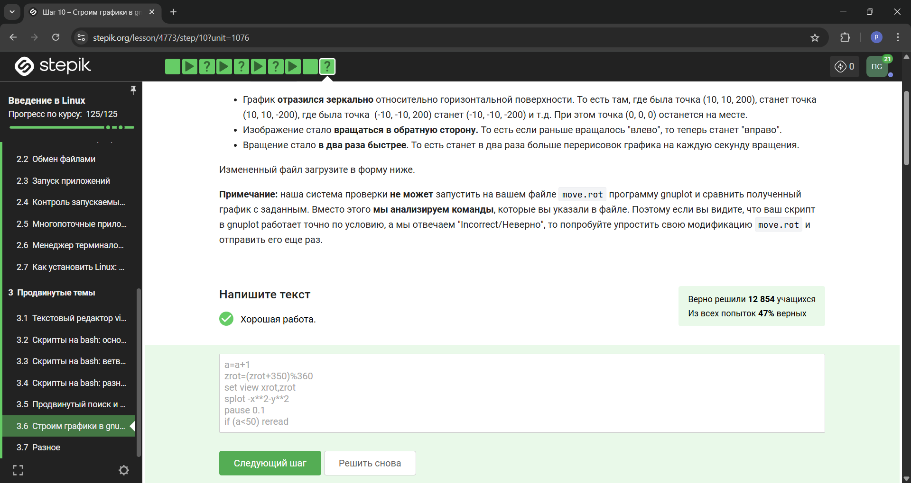

---
## Front matter
lang: ru-RU
title: Прохождение внешнего курса
subtitle: Этап 3
author:
  - Симонова П. И.
institute:
  - Российский университет дружбы народов, Москва, Россия
date: 17 мая 2025

## i18n babel
babel-lang: russian
babel-otherlangs: english

## Formatting pdf
toc: false
toc-title: Содержание
slide_level: 2
aspectratio: 169
section-titles: true
theme: metropolis
header-includes:
 - \metroset{progressbar=frametitle,sectionpage=progressbar,numbering=fraction}
---

# Информация

## Докладчик

:::::::::::::: {.columns align=center}
::: {.column width="70%"}

  * Симонова Полина Игоревна
  * студент группы НКАбд-04-24
  * Российский университет дружбы народов
  * [1132246738@rudn.ru](mailto:1132246738@rudn.ru)
  * <https://o5o6am.github.io/projects/>

:::
::: {.column width="30%"}


:::
::::::::::::::

# Вводная часть

## Сертификат

{#fig:001 width=70%}

## Задание 1

{#fig:001 width=70%}

Стоит упомянуть, что у редактора vim есть туториал, который позволяет разобраться с командами, необходимыми для стандартной работы. 


## Задание 2

{#fig:002 width=70%}


## Задание 3

{#fig:003 width=70%}

## Задание 4

{#fig:004 width=70%}

Поиск и замена в редакторе работают по следующей схеме:

`:{пределы}s/{что заменяем}/{на что заменяем}/{опции}`

Для замены во всем файле можно использовать символ %.

## Задание 5

{#fig:005 width=70%}

Команда $ — в конец текущей строки, W - до пробела вправо - то есть, перемещение.

## Задание 6

{#fig:006 width=70%}

Только из набора С потому что у каждой оболочки свой буфер, который при выходе из нее буде записываться в файл истории.

## Задание 7

{#fig:007 width=70%}

`/home/bi/file1.txt` - потому что именно в этой директории мы создаем новый файл, а уже после его создания мы переходим в другую папку.

## Задание 8

{#fig:008 width=70%}

Имя не может начинаться с цифры, содержать специальные символы или пробелы.

## Задание 9

{#fig:009 width=70%}

## Задание 10

{#fig:010 width=70%}

## Задание 11

{#fig:011 width=70%}


## Задание 12

{#fig:012 width=70%}

## Задание 13

{#fig:013 width=70%}

## Задание 14

{#fig:014 width=70%}

{#fig:015 width=70%}

## Задание 15

{#fig:016 width=70%}


## Задание 16

{#fig:017 width=70%}

Выведет путь до директории, в которую мы перешли, так как "```pwd```" - это команда

## Задание 16

{#fig:018 width=70%}

`programm`  выполняет стандартный вывод в терминал (если это принцип работы программы). И нам нужно настроить вывод в файл.

## Задание 17

{#fig:019 width=70%}

Первая переменная локальная, и это просто пустая строка, вторая переменная - это сумма арифметической прогрессии от 1 до 10, равна 55, но при умножении на 2 даст 110.

## Задание 18

{#fig:020 width=70%}


{#fig:021 width=70%}


## Задание 19

{#fig:022 width=70%}


{#fig:023 width=70%}

Калькулятор выглядит обычно - мы вводим два числа, пишем, что с ними надо сделать, и потом, учитывая случаи ошибок, выводим результат.

## Задание 20

{#fig:024 width=70%}

-iname ищет без учета регистра, а -name в точности как в запросе. Звездочка стоит после слова - это значит после слова может быть сколько угодно символов.

## Задание 21

{#fig:025 width=70%}

## Задание 22

{#fig:026 width=70%}

## Задание 23

{#fig:027 width=70%}

## Задание 24

{#fig:028 width=70%}

{#fig:029 width=70%}

Объяснение на втором скриншоте.

## Задание 25

{#fig:030 width=70%}

The -n option disables the automatic printing, which means the lines you don't specifically tell it to print do not get printed, and lines you do explicitly tell it to print (e.g. with p) get printed only once. 

## Задание 26

{#fig:031 width=70%}

## Задание 27

{#fig:032 width=70%}

-persist lets plot windows survive after main gnuplot program exits. 

## Задание 28

{#fig:033 width=70%}

## Задание 29

{#fig:034 width=70%}


## Задание 30

{#fig:035 width=70%}


## Задание 31

{#fig:036 width=70%}

## Задание 32

{#fig:037 width=70%}


## Задание 33

{#fig:038 width=70%}


## Задание 34

{#fig:039 width=70%}


## Задание 35

{#fig:040 width=70%}

Команда создаст три директории от dir1 до dir3. 
:::

