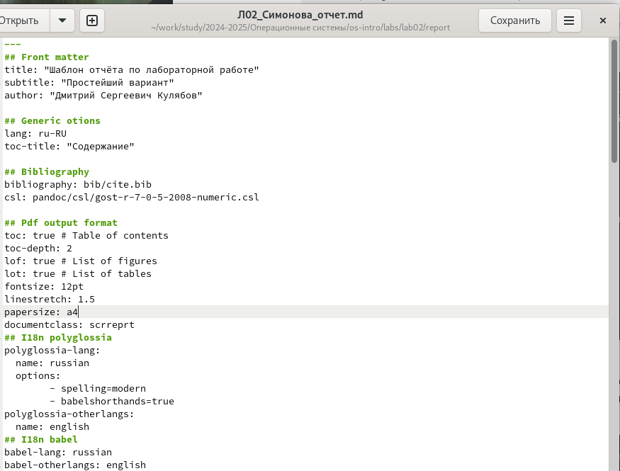

---
## Front matter
lang: ru-RU
title: Лабораторная работа №3
subtitle: Язык разметки Markdown
author:
  - Симонова П.И.
institute:
  - Российский университет дружбы народов, Москва, Росси
date: 04 марта 2025

## i18n babel
babel-lang: russian
babel-otherlangs: english

## Formatting pdf
toc: false
toc-title: Содержание
slide_level: 2
aspectratio: 169
section-titles: true
theme: metropolis
header-includes:
 - \metroset{progressbar=frametitle,sectionpage=progressbar,numbering=fraction}
---

# Информация

## Докладчик

:::::::::::::: {.columns align=center}
::: {.column width="70%"}

  * Симонова Полина Игоревна
  * НКАбд-04-24, студент бакалавриата
  * Российский университет дружбы народов
  * [1132246738@rudn.ru]
  * <https://o5o6am.github.io/>

:::
::: {.column width="30%"}

:::
::::::::::::::

# Вводная часть

## Цели и задачи

- Научиться оформлять отчёты с помощью легковесного языка разметки Markdown.
- Сделать отчёт по предыдущей лабораторной работе в формате Markdown.

## Теоретическое введение

Markdown — облегчённый язык разметки, созданный с целью обозначения форматирования в простом тексте, с максимальным сохранением его читаемости человеком, и пригодный для машинного преобразования в языки для продвинутых публикаций.

## Выполнение лабораторной работы

Создаю копию шаблона, в которой буду работать (рис. 1).

{width=50%}

## Выполнение лабораторной работы

- открываю созданный файл (рис. 2).
- редактирую его, используя язык рамзетки Markdown

{width=70%}

## Выполнение лабораторной работы

Выполнила компиляцию отчета из формата md в форматы docx и pdf (рис. 4).

{width=70%}

## Выводы

При выполнении данной лабораторной работы я научилась оформлять отчеты с помощью легковесного языка разметки Markdown.

