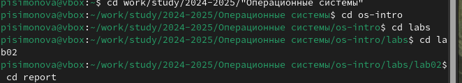
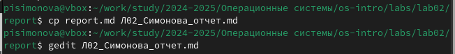
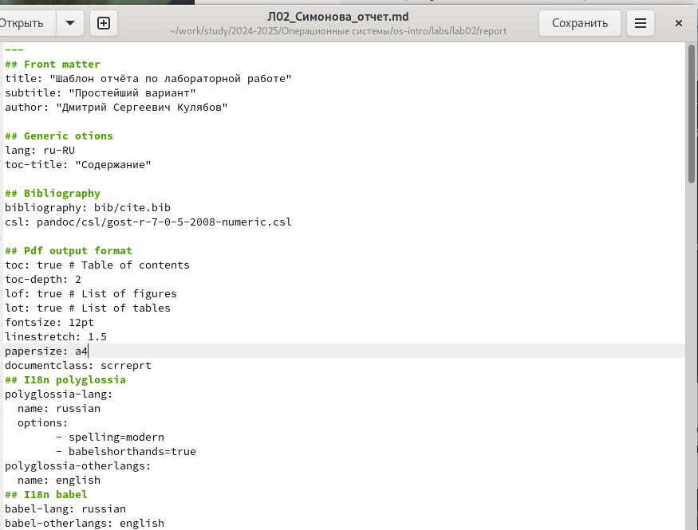
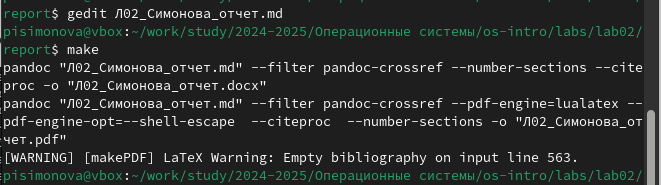
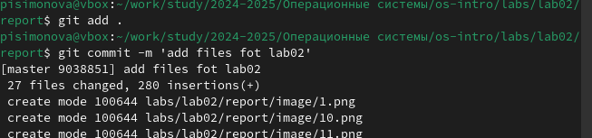
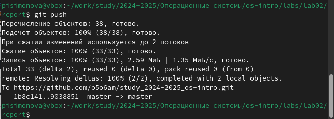

---
## Front matter
title: "Отчет по лабораторной работе №3"
subtitle: "Язык разметки Markdown"
author: "Симонова Полина Игоревна"

## Generic otions
lang: ru-RU
toc-title: "Содержание"

## Bibliography
bibliography: bib/cite.bib
csl: pandoc/csl/gost-r-7-0-5-2008-numeric.csl

## Pdf output format
toc: true # Table of contents
toc-depth: 2
lof: true # List of figures
fontsize: 12pt
linestretch: 1.5
papersize: a4
documentclass: scrreprt
## I18n polyglossia
polyglossia-lang:
  name: russian
  options:
	- spelling=modern
	- babelshorthands=true
polyglossia-otherlangs:
  name: english
## I18n babel
babel-lang: russian
babel-otherlangs: english
## Fonts
mainfont: IBM Plex Serif
romanfont: IBM Plex Serif
sansfont: IBM Plex Sans
monofont: IBM Plex Mono
mathfont: STIX Two Math
mainfontoptions: Ligatures=Common,Ligatures=TeX,Scale=0.94
romanfontoptions: Ligatures=Common,Ligatures=TeX,Scale=0.94
sansfontoptions: Ligatures=Common,Ligatures=TeX,Scale=MatchLowercase,Scale=0.94
monofontoptions: Scale=MatchLowercase,Scale=0.94,FakeStretch=0.9
mathfontoptions:
## Biblatex
biblatex: true
biblio-style: "gost-numeric"
biblatexoptions:
  - parentracker=true
  - backend=biber
  - hyperref=auto
  - language=auto
  - autolang=other*
  - citestyle=gost-numeric
## Pandoc-crossref LaTeX customization
figureTitle: "Рис."
tableTitle: "Таблица"
listingTitle: "Листинг"
lofTitle: "Список иллюстраций"
lolTitle: "Листинги"
## Misc options
indent: true
header-includes:
  - \usepackage{indentfirst}
  - \usepackage{float} # keep figures where there are in the text
  - \floatplacement{figure}{H} # keep figures where there are in the text
---

# Цель работы

Цель данной лабораторной работы - научиться оформлять отчёты с помощью легковесного языка разметки Markdown.

# Задание

– Сделайте отчёт по предыдущей лабораторной работе в формате Markdown.
– В качестве отчёта просьба предоставить отчёты в 3 форматах: pdf, docx и md (в архиве, поскольку он должен содержать скриншоты, Makefile и т.д.)

# Теоретическое введение

Markdown — облегчённый язык разметки, созданный с целью обозначения форматирования в простом тексте, с максимальным сохранением его читаемости человеком, и пригодный для машинного преобразования в языки для продвинутых публикаций.

# Выполнение лабораторной работы

Перехожу в каталог, в котором находится шаблон для отчета по лабораторной работы, с помощью утилиты cd (рис. @fig:001).

{#fig:001 width=70%}

Создаю копию шаблона, в которой буду работать с помощью утилиты cp (рис. @fig:002).

{#fig:002 width=70%}

Открываю созданный файл с помощью текстового редактора Gedit (можно открыть с помощью редактора Kwrite или Mousepad) (рис. @fig:003).

{#fig:003 width=70%}

После изменения шаблона в соответсвии с языком разметки Markdown, я выполнила его компиляцию из формата md в форматы docx и pdf (рис. @fig:004).

{#fig:004 width=70%}

Далее я отправила созданные и скомпилированные файлы на глобальный репозиторий (рис. @fig:005).

{#fig:005 width=70%}

Последнее действие это отправка с помощью команды git push (рис. @fig:006).

{#fig:006 width=70%}

# Выводы

Выполняя данную лабораторную работу, я научилась оформлять отчёты с помощью легковесного языка разметки Markdown.

# Список литературы

