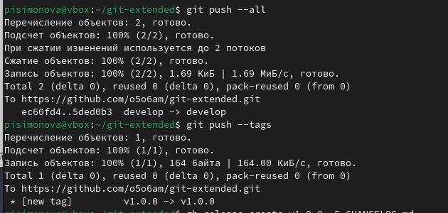

---
## Front matter
lang: ru-RU
title: Лабораторная работа №4
subtitle: Продвинутое использование git
author:
  - Симонова П.И.
institute:
  - Российский университет дружбы народов, Москва, Россия
date: 04 марта 2025

## i18n babel
babel-lang: russian
babel-otherlangs: english

## Formatting pdf
toc: false
toc-title: Содержание
slide_level: 2
aspectratio: 169
section-titles: true
theme: metropolis
header-includes:
 - \metroset{progressbar=frametitle,sectionpage=progressbar,numbering=fraction}
---

# Информация

## Докладчик

:::::::::::::: {.columns align=center}
::: {.column width="70%"}

  * Симонова Полина Игоревна
  * НКАбд-04-24, студент бакалавриата
  * Российский университет дружбы народов
  * [1132246738@rudn.ru]
  * <https://o5o6am.github.io/>

:::
::: {.column width="30%"}

:::
::::::::::::::

# Цель работы

Получение навыков правильной работы с репозиториями git.

# Задание

1. Выполнить работу для тестового репозитория.
2. Преобразовать рабочий репозиторий в репозиторий с git-flow и conventional commits.

# Теоретическое введение

## Рабочий процесс Gitflow

Рабочий процесс Gitflow Workflow. Будем описывать его с использованием пакета git-flow.
Общая информация
Gitflow Workflow опубликована и популяризована Винсентом Дриссеном.
Gitflow Workflow предполагает выстраивание строгой модели ветвления с учётом выпуска проекта.
Данная модель отлично подходит для организации рабочего процесса на основе релизов.
Работа по модели Gitflow включает создание отдельной ветки для исправлений ошибок в рабочей среде.
Последовательность действий при работе по модели Gitflow:
Из ветки master создаётся ветка develop.
Из ветки develop создаётся ветка release.
Из ветки develop создаются ветки feature.
Когда работа над веткой feature завершена, она сливается с веткой develop.
Когда работа над веткой релиза release завершена, она сливается в ветки develop и master.
Если в master обнаружена проблема, из master создаётся ветка hotfix.
Когда работа над веткой исправления hotfix завершена, она сливается в ветки develop и master.

# Выполнение лабораторной работы

## Установка программного обеспечения.

## Установка git-flow

1. Открываем терминал и входим в режим суперпользователя, устанавливаем gitflow. 

{#fig:001 width=70%}

## Установка и настройка node.js

2. Устанавливаем pnpm и nodejs. 

{#fig:002 width=70%}

##

3. Настраиваем nodejs. 

{#fig:003 width=70%}

## Общепринятые коммиты.

4. Настраиваем commitizen и standard-changelog.

{#fig:004 width=70%}

## Практический сценарий использования git. 

## Создание репозитория git.

5. Создаем репозиторий git, настраиваем его и делаем в него первый коммит. 

##

{#fig:005 width=70%}

##

6. Настраиваем пакет файлов nodejs. В файле package.json меняем необходимые данные.

##

{#fig:006 width=70%}

##

{#fig:007 width=70%}

##

7. Выполняем коммит. Выкладываем на github. 

{#fig:008 width=70%}

##

{#fig:009 width=70%}

##

8. Инициализируем gitflow, проверяем, на какой ветке мы находимся в данный момент, после чего загружаем весь репозиторий в хранилище.

{#fig:010 width=70%}

##

9. Устанавливаем внешнюю ветку как вышестоящую для этой ветки. Создаем релиз с версией 1.0.0 и журнал изменений..

{#fig:011 width=70%}

##

10. Заливаем релизную ветку в основную, добавляем журнал изменений в индекс, после чего заливаем релизную ветку в основную. 

{#fig:012 width=70%}

##

11. Отправляем данные и теги на гитхаб.

{#fig:013 width=70%}

## Работа с репозиторием git.

12. Создаем релиз на гитхабе. Создаем ветку для новой функциональности.

{#fig:014 width=70%}

##

13. Объединяем новую ветку с develop. Создаём релиз с версией 1.2.3.

{#fig:015 width=70%}

##

14. Изменяем номер версии в файле package.json.

{#fig:016 width=70%}

##

15. Заливаем релизную ветку в основную. Отправляем данные на гитхаб.

{#fig:017 width=70%}

##

{#fig:018 width=70%}

##

16. Создаём релиз на гитхабе с комментарием из журнала изменений.

{#fig:019 width=70%}

# Выводы

В процессе выполнения лабораторной работы я приобрела навыки правильной работы с репозиториями git.

