---
## Front matter
title: "Отчет по лабораторной  работе №5"
subtitle: "Настройка рабочей среды"
author: "Симонова Полина Игоревна"

## Generic otions
lang: ru-RU
toc-title: "Содержание"

## Bibliography
bibliography: bib/cite.bib
csl: pandoc/csl/gost-r-7-0-5-2008-numeric.csl

## Pdf output format
toc: true # Table of contents
toc-depth: 2
lof: true # List of figures
fontsize: 12pt
linestretch: 1.5
papersize: a4
documentclass: scrreprt
## I18n polyglossia
polyglossia-lang:
  name: russian
  options:
	- spelling=modern
	- babelshorthands=true
polyglossia-otherlangs:
  name: english
## I18n babel
babel-lang: russian
babel-otherlangs: english
## Fonts
mainfont: IBM Plex Serif
romanfont: IBM Plex Serif
sansfont: IBM Plex Sans
monofont: IBM Plex Mono
mathfont: STIX Two Math
mainfontoptions: Ligatures=Common,Ligatures=TeX,Scale=0.94
romanfontoptions: Ligatures=Common,Ligatures=TeX,Scale=0.94
sansfontoptions: Ligatures=Common,Ligatures=TeX,Scale=MatchLowercase,Scale=0.94
monofontoptions: Scale=MatchLowercase,Scale=0.94,FakeStretch=0.9
mathfontoptions:
## Biblatex
biblatex: true
biblio-style: "gost-numeric"
biblatexoptions:
  - parentracker=true
  - backend=biber
  - hyperref=auto
  - language=auto
  - autolang=other*
  - citestyle=gost-numeric
## Pandoc-crossref LaTeX customization
figureTitle: "Рис."
tableTitle: "Таблица"
listingTitle: "Листинг"
lofTitle: "Список иллюстраций"
lolTitle: "Листинги"
## Misc options
indent: true
header-includes:
  - \usepackage{indentfirst}
  - \usepackage{float} # keep figures where there are in the text
  - \floatplacement{figure}{H} # keep figures where there are in the text
---

# Цель работы

Познакомиться с pass, gopass, native messaging, chezmoi. Научиться пользоваться этими утилитами, синхронизировать их с гит.

# Задание

1. Установить дополнительное ПО
2. Установить и настроить pass
3. Настроить интерфейс с браузером
4. Сохранить пароль
5. Установить и настроить chezmoi
6. Настроить chezmoi на новой машине
7. Выполнить ежедневные операции с chezmoi

# Теоретическое введение

Менеджер паролей pass — программа, сделанная в рамках идеологии Unix. Также носит название стандартного менеджера паролей для Unix (The standard Unix password manager).
1.1 Основные свойства
    Данные хранятся в файловой системе в виде каталогов и файлов.
    Файлы шифруются с помощью GPG-ключа.
1.2 Структура базы паролей
    Структура базы может быть произвольной, если Вы собираетесь использовать её напрямую, без промежуточного программного обеспечения. Тогда семантику структуры базы данных Вы держите в своей голове.
    Если же необходимо использовать дополнительное программное обеспечение, необходимо семантику заложить в структуру базы паролей.
chezmoi используется для управления файлами конфигурации домашнего каталога пользователя. 
Конфигурация chezmoi
    2.2.1 Рабочие файлы
    Состояние файлов конфигурации сохраняется в каталоге ~/.local/share/chezmoi. Он является клоном вашего репозитория dotfiles.
    Файл конфигурации ~/.config/chezmoi/chezmoi.toml (можно использовать также JSON или YAML) специфичен для локальной машины.
    Файлы, содержимое которых одинаково на всех ваших машинах, дословно копируются из исходного каталога.
    Файлы, которые варьируются от машины к машине, выполняются как шаблоны, обычно с использованием данных из файла конфигурации локальной машины для настройки конечного содержимого, специфичного для локальной машины.

# Выполнение лабораторной работы

## Менеджер паролей pass. Установка, настройка.

1. Устанавливаем pass и gopass (рис. @fig:001). (рис. @fig:002). 

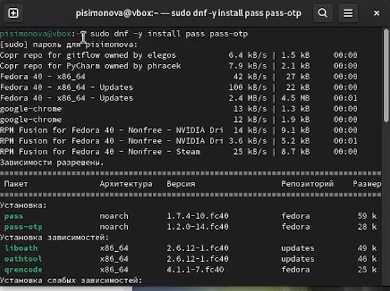{#fig:001 width=70%}

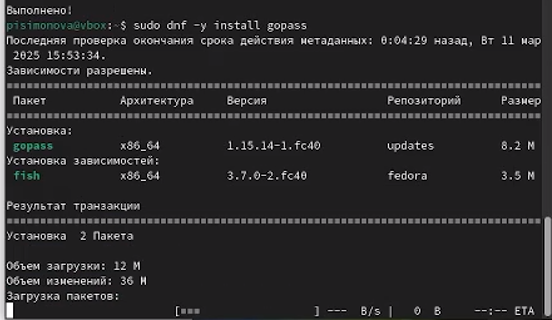{#fig:002 width=70%}

2. Просмотрим список ключей. Инициализируем хранилище. Синхронизируемс git Создадим структуру git.(рис. @fig:003).

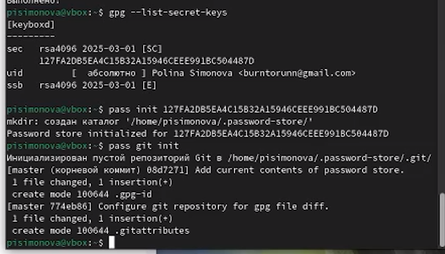{#fig:003 width=70%}

3. Также можно задать адрес репозитория на хостинге (репозиторий необходимо предварительно создать).  Для синхронизации выполняется следующая команда:  pass git pull pass git push Следует заметить, что отслеживаются только изменения, сделанные через сам gopass (или pass). Если изменения сделаны непосредственно на файловой системе, необходимо вручную закоммитить и выложить изменения. Проверим статус синхронизации. (рис. @fig:005).  (рис. @fig:006).  (рис. @fig:007).

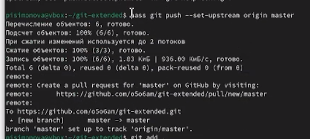{#fig:005 width=70%}

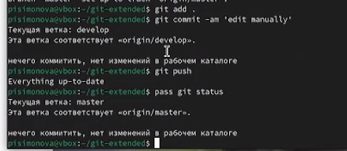{#fig:006 width=70%}

## Настройка интерфейса с броузером

6.  Для взаимодействия с броузером используем интерфейс native messaging. Кроме плагина к броузеру устанавливается программа, обеспечивающая интерфейс native messaging. (рис. @fig:008). (рис. @fig:009).

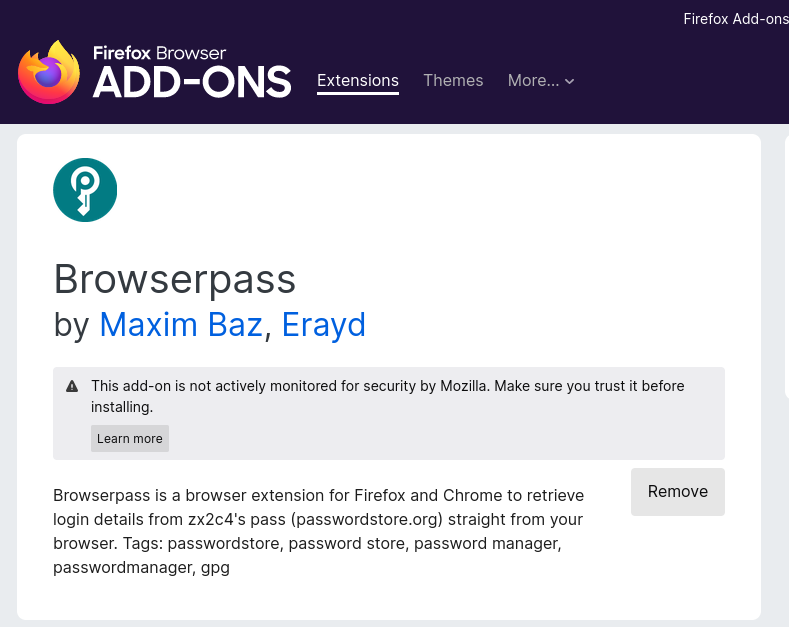{#fig:007 width=70%}

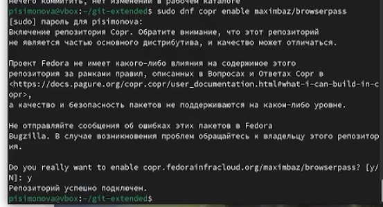{#fig:008 width=70%} 

## Сохранение пароля

9. Добавим новый пароль. Отобразим пароль для указанного имени файла. Заменим существующий пароль: (рис. @fig:010).

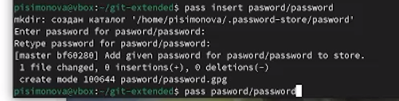{#fig:009 width=70%} 

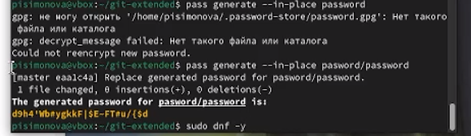{#fig:010 width=70%} 

## Управление файлами конфигурации. Установка. Использование chezmoi 

10. Установим дополнительное программное обеспечение. Установим шрифты. (рис. @fig:011). (рис. @fig:012).  (рис. @fig:013).

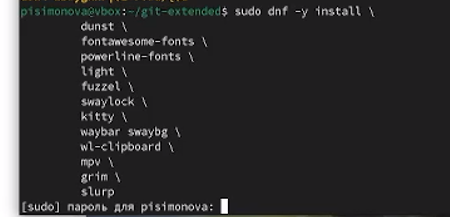{#fig:011 width=70%} 

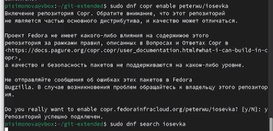{#fig:012 width=70%} 

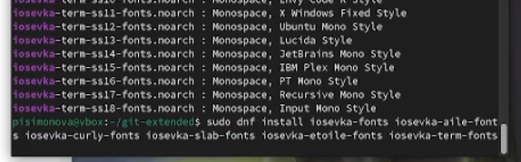{#fig:013 width=70%} 

11.  Установим бинарный файл. Создадим собственный репозиторий с помощью утилит Создадим свой репозиторий для конфигурационных файлов на основе шаблона: Инициализируем chezmoi с репозиторием dotfiles:  Проверим, какие изменения внесёт chezmoi в домашний каталог. Запустим: chezmoi apply -v  (рис. @fig:014).  (рис. @fig:015).

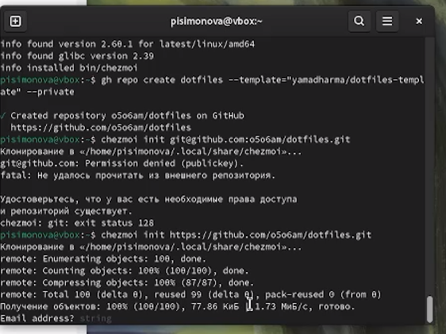{#fig:014 width=70%} 

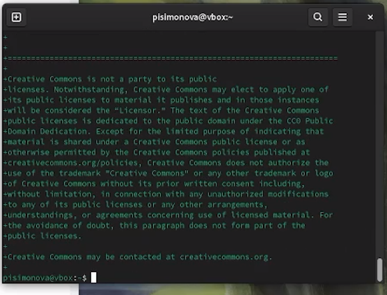{#fig:015 width=70%} 

12. На второй машине инициализируем chezmoi с репозиторием dotfiles. Проверим, какие изменения внесёт chezmoi в домашний каталог. Я настроила репозиторий заранее, поэтому изменений нет.  При существующем каталоге chezmoi можно получить и применить последние изменения из репозитория.   Можно установить свои dotfiles на новый компьютер с помощью одной команды. Извлечем последние изменения из своего репозитория и посмотрим, что изменится, фактически не применяя изменения. Применим изменения  (рис. @fig:017). 

{#fig:016 width=70%} 

13. Можно автоматически фиксировать и отправлять изменения в исходный каталог в репозиторий. Эта функция отключена по умолчанию. Чтобы включить её, добавим в файл конфигурации ~/.config/chezmoi/chezmoi.toml следущие строки: (рис. @fig:017). 

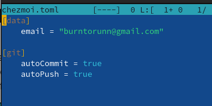{#fig:017 width=70%} 

# Выводы

Мы познакомились с pass, gopass, native messaging, chezmoi. Научились пользоваться этими утилитами, синхронизировали их с гит.

