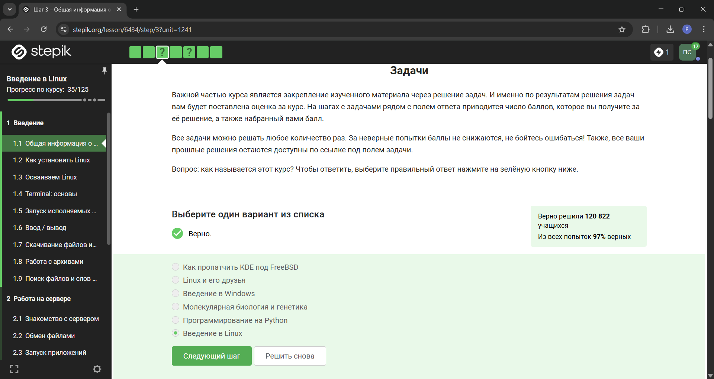
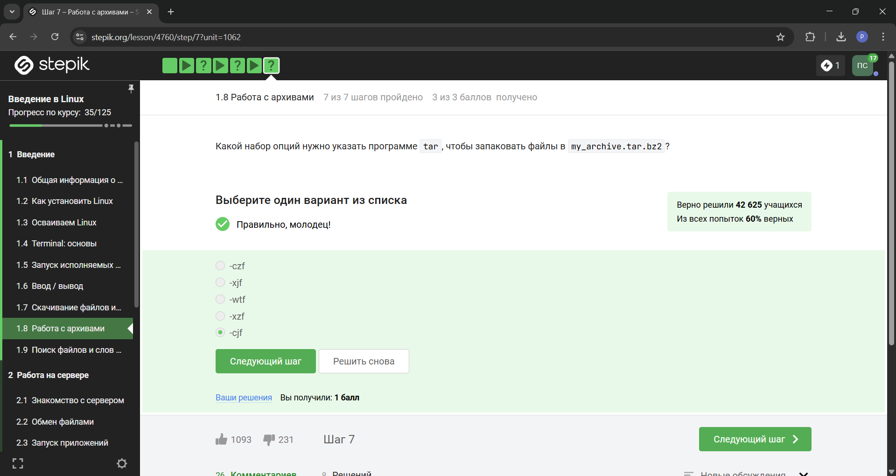

---
## Front matter
lang: ru-RU
title: Отчет о прохождении внешнего курса
subtitle: 1 этап
author:
  - Симонова П. И.
institute:
  - Российский университет дружбы народов, Москва, Россия
date: 01 января 1970

## i18n babel
babel-lang: russian
babel-otherlangs: english

## Formatting pdf
toc: false
toc-title: Содержание
slide_level: 2
aspectratio: 169
section-titles: true
theme: metropolis
header-includes:
 - \metroset{progressbar=frametitle,sectionpage=progressbar,numbering=fraction}
---

# Информация

## Докладчик

:::::::::::::: {.columns align=center}
::: {.column width="70%"}

  * Симонова Полина Игоревна
  * студент НКАбд-04-24
  * Российский университет дружбы народов
  * [1132246738@rudn.ru](mailto:1132246738@rudn.ru)
  * <https://o5o6am.github.io/>

:::
::: {.column width="30%"}

:::
::::::::::::::

# Цель работы

Пройти 1 этап курса 'Введение в Linux' на платформе Stepik. Ознакомиться с функционалом операционной системы Linux.

# Задание

Просмотреть обучающие видео и на основе полученной информации пройти тестовые задания.

# Выполнение внешнего курса

Курс действительно называется "Введение в Linux", поэтому с этим вопросом проблем не возникло.

{#fig:001 width=90%}

# Выполнение внешнего курса

Прочитав критерии прохождения курса, я отметила необходимые утверждения.

{#fig:002 width=90%}

# Выполнение внешнего курса

Стандартная операционная система, предлагаемая большей частью магазинов - windows, именно она стоит у меня на основном компьютере.

{#fig:003 width=90%}

# Выполнение внешнего курса

На свой компьютер мы устанавливали специальную программу VirtualBox, которая нужна для подключения одной операционной на другой.

{#fig:004 width=90%}

# Выполнение внешнего курса

Да, моя виртуальная машина хорошо работает, и у меня получилось запустить с неё Линукс.

{#fig:005 width=90%}

# Выполнение внешнего курса

Я создала документ, и перед сохранением выбрала нужный формат, а после я ег прикрепила к курсу.

{#fig:006 width=90%}

# Выполнение внешнего курса

deb - формат пакетов ОС проекта Debian. Используется также их производными, например Ubuntu, Knoppix и другими

{#fig:007 width=90%}

# Выполнение внешнего курса

Первый автор - Denis-Cormount. На скринкасте будет видно, как я установила программу медиапрогрывателя и посмотрела авторов программы.

{#fig:008 width=90%}

# Выполнение внешнего курса

Менеджер обновлений - программа для обновления установленного ПО в дистрибутивах линукса, основанных на Debian или использующих систему управления пакетами APT. Менеджер обновлений устанавливает обновления безопасности или просто улучшающие функциональность программы.

{#fig:009 width=90%}

# Выполнение внешнего курса

Ассоль - женское русское имя, термин - определение, консоль и терминал - синонимы для командной строки.

{#fig:010 width=90%}

# Выполнение внешнего курса

Интерфейс командной строки линукс является регистрозависимым.

{#fig:011 width=90%}

# Выполнение внешнего курса

Интерфейс командной строки линукс является регистрозависимым, поэтому не все варианты подходят

{#fig:013 width=90%}

# Выполнение внешнего курса

rm -r - удаление директории и рекуррентное удаление всех файлов, которые в ней находились.

{#fig:014 width=90%}

# Выполнение внешнего курса

Это я проверила эмпирическим путём, что видно в ходе скринкаста.

{#fig:015 width=90%}

# Выполнение внешнего курса

Это запуск программы в фоновом режиме.

{#fig:016 width=90%}

# Выполнение внешнего курса

Здесь видно выполнение команды.

{#fig:017 width=90%}

# Выполнение внешнего курса

Автоматически поток ошибок выводится на экран - это видно, например, в ходе выполненных лабораторных. В файл будет поток выводиться, если его перенаправить.

{#fig:018 width=90%}

# Выполнение внешнего курса

gzip (сокращение от GNU Zip) — утилита сжатия и восстановления (декомпрессии) файлов, использующая алгоритм Deflate.

{#fig:024 width=90%}

# Выполнение внешнего курса

c - архиватор

j - указатель на тип архиватора bzip 

f - потому что создаем архив в файловой системе

{#fig:026 width=90%}

# Выполнение внешнего курса

`?` = один символ

`alexey` = маленькая буква

И файл должен быть `jpeg`, а не `jpg`

{#fig:027 width=90%}

# Выполнение внешнего курса

Регистр - маленькая буква, слово - `world`, а не `word`

{#fig:028 width=90%}

# Выполнение внешнего курса

grep -r "love" ~/Shakespeare/ > 1_m.txt`

{#fig:029 width=90%}

# Выводы

Я прошла 1 этап курса 'Введение в Linux' на платформе Stepik и ознакомилась с функционалом операционной системы Linux.

