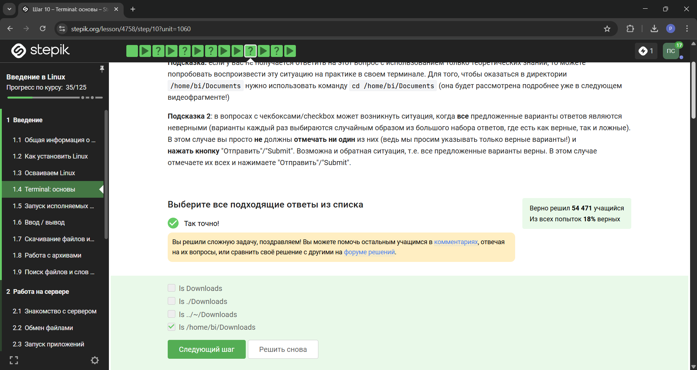

---
## Front matter
title: "Отчет о прохождении внешнего курса"
subtitle: "1 этап"
author: "Симонова Полина Игоревна"

## Generic otions
lang: ru-RU
toc-title: "Содержание"

## Bibliography
bibliography: bib/cite.bib
csl: pandoc/csl/gost-r-7-0-5-2008-numeric.csl

## Pdf output format
toc: true # Table of contents
toc-depth: 2
lof: true # List of figures
fontsize: 12pt
linestretch: 1.5
papersize: a4
documentclass: scrreprt
## I18n polyglossia
polyglossia-lang:
  name: russian
  options:
	- spelling=modern
	- babelshorthands=true
polyglossia-otherlangs:
  name: english
## I18n babel
babel-lang: russian
babel-otherlangs: english
## Fonts
mainfont: IBM Plex Serif
romanfont: IBM Plex Serif
sansfont: IBM Plex Sans
monofont: IBM Plex Mono
mathfont: STIX Two Math
mainfontoptions: Ligatures=Common,Ligatures=TeX,Scale=0.94
romanfontoptions: Ligatures=Common,Ligatures=TeX,Scale=0.94
sansfontoptions: Ligatures=Common,Ligatures=TeX,Scale=MatchLowercase,Scale=0.94
monofontoptions: Scale=MatchLowercase,Scale=0.94,FakeStretch=0.9
mathfontoptions:
## Biblatex
biblatex: true
biblio-style: "gost-numeric"
biblatexoptions:
  - parentracker=true
  - backend=biber
  - hyperref=auto
  - language=auto
  - autolang=other*
  - citestyle=gost-numeric
## Pandoc-crossref LaTeX customization
figureTitle: "Рис."
tableTitle: "Таблица"
listingTitle: "Листинг"
lofTitle: "Список иллюстраций"
lolTitle: "Листинги"
## Misc options
indent: true
header-includes:
  - \usepackage{indentfirst}
  - \usepackage{float} # keep figures where there are in the text
  - \floatplacement{figure}{H} # keep figures where there are in the text
---

# Цель работы

Пройти 1 этап курса 'Введение в Linux' на платформе Stepik. Ознакомиться с функционалом операционной системы Linux.

# Задание

Просмотреть обучающие видео и на основе полученной информации пройти тестовые задания.

# Теоретическое введение

Линукс - в части случаев GNU/Linux — семейство Unix-подобных операционных систем на базе ядра Linux, включающих тот или иной набор утилит и программ проекта GNU, и, возможно, другие компоненты. Как и ядро Linux, системы на его основе, как правило, создаются и распространяются в соответствии с моделью разработки свободного и открытого программного обеспечения. Linux-системы распространяются в основном бесплатно в виде различных дистрибутивов — в форме, готовой для установки и удобной для сопровождения и обновлений, — и имеющих свой набор системных и прикладных компонентов, как свободных, так и проприетарных. 

# Выполнение внешнего курса

1 Этап: (рис. @fig:001, @fig:002, @fig:003, @fig:004, @fig:005, @fig:006, @fig:007, @fig:008, @fig:009, @fig:010, @fig:011, @fig:012, @fig:013, @fig:014, @fig:015, @fig:016, @fig:017, @fig:018, @fig:019, @fig:020, @fig:021, @fig:022, @fig:023, @fig:024, @fig:025, @fig:026, @fig:027, @fig:028, @fig:029).

Курс действительно называется "Введение в Linux", поэтому с этим вопросом проблем не возникло.

{#fig:001 width=90%}

Прочитав критерии прохождения курса, я отметила необходимые утверждения.

{#fig:002 width=90%}

Стандартная операционная система, предлагаемая большей частью магазинов - windows, именно она стоит у меня на основном компьютере.

{#fig:003 width=90%}

На свой компьютер мы устанавливали специальную программу VirtualBox, которая нужна для подключения одной операционной на другой.

{#fig:004 width=90%}

Да, моя виртуальная машина хорошо работает, и у меня получилось запустить с неё Линукс.

{#fig:005 width=90%}

Я создала документ, и перед сохранением выбрала нужный формат, а после я ег прикрепила к курсу.

{#fig:006 width=90%}

deb - формат пакетов ОС проекта Debian. Используется также их производными, например Ubuntu, Knoppix и другими

{#fig:007 width=90%}

Первый автор - Denis-Cormount. На скринкасте будет видно, как я установила программу медиапрогрывателя и посмотрела авторов программы.

{#fig:008 width=90%}

Менеджер обновлений - программа для обновления установленного ПО в дистрибутивах линукса, основанных на Debian или использующих систему управления пакетами APT. Менеджер обновлений устанавливает обновления безопасности или просто улучшающие функциональность программы.

{#fig:009 width=90%}

Ассоль - женское русское имя, термин - определение, консоль и терминал - синонимы для командной строки.

{#fig:010 width=90%}

Интерфейс командной строки линукс является регистрозависимым.

{#fig:011 width=90%}

Интерфейс командной строки линукс является регистрозависимым, поэтому не все варианты подходят???

{#fig:012 width=90%}

{#fig:013 width=90%}

rm -r - удаление директории и рекуррентное удаление всех файлов, которые в ней находились.

{#fig:014 width=90%}

Это я проверила эмпирическим путём, что видно в ходе скринкаста.

{#fig:015 width=90%}

Это запуск программы в фоновом режиме.

{#fig:016 width=90%}

Здесь видно выполнение команды.

{#fig:017 width=90%}

Автоматически поток ошибок выводится на экран - это видно, например, в ходе выполненных лабораторных. В файл будет поток выводиться, если его перенаправить.

{#fig:018 width=90%}

< file — использовать файл как источник данных для стандартного потока ввода.

> file — направить стандартный поток вывода в файл. Если файл не существует, он будет создан, если существует — перезаписан сверху.

2> file — направить стандартный поток ошибок в файл. Если файл не существует, он будет создан, если существует — перезаписан сверху.

>>file — направить стандартный поток вывода в файл. Если файл не существует, он будет создан, если существует — данные будут дописаны к нему в конец.

2>>file — направить стандартный поток ошибок в файл. Если файл не существует, он будет создан, если существует — данные будут дописаны к нему в конец.

&>file или >&file — направить стандартный поток вывода и стандартный поток ошибок в файл. Другая форма записи: >file 2>&1.

{#fig:019 width=90%}

1. cat names.txt | ./interacter.py | less = вывод на экран

2. cat names.txt | ./interacter.py 2>err.txt | less = вывод ошибки в err.txt

{#fig:020 width=90%}

Команда wget -P /home/alex/Pictures http://example.com/example.jpg  скачивает файл и даже размещает его, назвав example.jpg, в папке /home/alex/Pictures. Но после этих манипуляций срабатывает часть ключа -O 1.jpg и только что скачаный example.jpg конвертируется в 1.jpg и размещается в текущей директории, в которой мы находимся, потому что путь файла уже не указан, указано только название - 1.jpg.

{#fig:021 width=90%}

-q
--quiet
    Turn off Wget's output. 

{#fig:022 width=90%}

Wget предлагает две опции для решения этой проблемы. В описании каждой опции перечислены краткое имя, длинное имя и эквивалентная команда в .wgetrc.

'-A acclist'
'--accept acclist'
'accept = acclist'
'--accept-regex urlregex'
'accept-regex = urlregex'

Аргумент опции '--accept' представляет собой список суффиксов или шаблонов файлов, которые Wget будет загружать при рекурсивном получении. Суффикс - это конечная часть файла, состоящая из "обычных" букв, например, 'gif' или '.jpg'. Шаблон совпадения содержит подстановочные знаки типа shell, например, 'books*'.

Таким образом, указав 'wget -A gif,jpg', Wget загрузит только файлы, заканчивающиеся на 'gif' или 'jpg', то есть GIF и JPEG. С другой стороны, 'wget -A "zelazny*196[0-9]*" загрузит только файлы, начинающиеся с 'zelazny' и содержащие в себе числа от 1960 до 1969. Описание того, как работает сопоставление шаблонов, можно найти в руководстве к вашей оболочке.

{#fig:023 width=90%}

gzip (сокращение от GNU Zip) — утилита сжатия и восстановления (декомпрессии) файлов, использующая алгоритм Deflate.

{#fig:024 width=90%}

{#fig:025 width=90%}

c - архиватор

j - указатель на тип архиватора bzip 

f - потому что создаем архив в файловой системе

{#fig:026 width=90%}

`?` = один символ

`alexey` = маленькая буква

И файл должен быть `jpeg`, а не `jpg`

{#fig:027 width=90%}

Регистр - маленькая буква, слово - `world`, а не `word`

{#fig:028 width=90%}

grep -r "love" ~/Shakespeare/ > 1_m.txt`

{#fig:029 width=90%}

# Выводы

Я прошла 1 этап курса 'Введение в Linux' на платформе Stepik и ознакомилась с функционалом операционной системы Linux.

# Список литературы{.unnumbered}

::: {#refs}
:::
