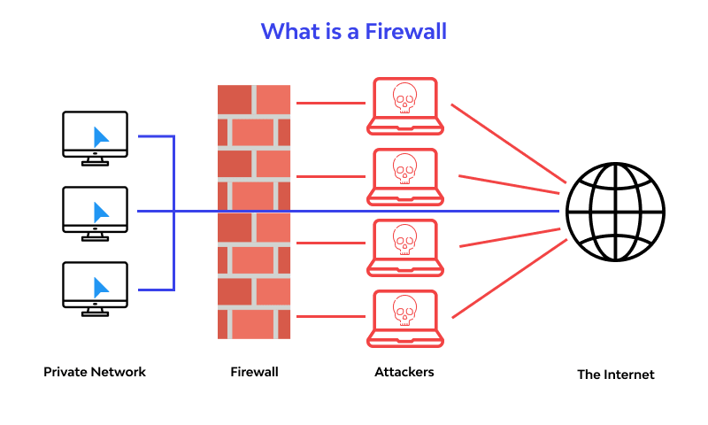

---
## Front matter
lang: ru-RU
title: Методы организации безопасности в операционных системах
subtitle: Операционные системы
author:
  - Симонова Полина Игоревна
institute:
  - Российский университет дружбы народов, Москва, Россия
date:
  - 31.03.2025

## i18n babel
babel-lang: russian
babel-otherlangs: english

## Formatting pdf
toc: false
toc-title: Содержание
slide_level: 2
aspectratio: 169
section-titles: true
theme: metropolis
header-includes:
 - \metroset{progressbar=frametitle,sectionpage=progressbar,numbering=fraction}
---

# Информация

## Докладчик

:::::::::::::: {.columns align=center}
::: {.column width="70%"}

  * Симонова Полина Игоревна
  * студент группы НКАбд-04-24
  * Российский университет дружбы народов
  * [1132246738@rudn.ru](mailto:1132246738@rudn.ru)
  * <https://o5o6am.github.io/>

:::
::: {.column width="30%"}

:::
::::::::::::::

## Актуальность

Актуальность моего доклада обусловлена ростом киберугроз и необходимостью защиты конфиденциальной информации в корпоративных и частных системах.

## Объект и предмет исследования

- Объектом исследования являются операционные системы и их безопасность 
- Предметом исследования являются различные методы и механизмы обеспечения безопасности в ОС

## Цель работы

- Изучить основные методы обеспечения безопасности операционных систем и способы их применения в современных ОС (Windows, macOS, Linux)

## Задачи

- Изучить механизмы аутентификации и авторизации, их роль в защите данных;

- Рассмотреть методы защиты памяти и процессов от вредносного воздействия;

- Изучить межсетевые экраны и системы обнаружения вторжений, их роль в обеспечении безопасности.

## Теоретическое введение

Безопасность ОС — критически важный аспект, поскольку уязвимости могут привести к утечке данных, несанкционированному доступу и другим киберугрозам. 

## Аутентификация и авторизация

Аутентификация — процедура проверки подлинности 

: Методы аутентификации

| Метод          | Примеры                 | Надежность | 
|----------------|-------------------------|------------|
| Пароли         | Логин/пароль           | Низкая     |
| 2FA            | SMS, Google Auth       | Средняя    |
| Биометрия      | Face ID, отпечаток     | Высокая    |
| Сертификаты    | PKI, Smart-карты       | Очень высокая |

## Авторизация

Авторизация - предоставление прав доступа.

Основные методы:

* Дискреционное управление доступом (DAC) — владелец ресурса сам назначает права (например, в Linux через chmod). 

* Мандатное управление доступом (MAC) — строгие правила, заданные администратором (используется в SELinux). 

* Ролевое управление доступом (RBAC) — права назначаются ролям, а не пользователям. 

## Разделение адресных пространств 

ОС изолирует процессы, предотвращая их вмешательство в работу друг друга.

{#fig:001 width=70%}

## Шифрование файловых систем 

Шифрование — это метод защиты информации путём преобразования её в зашифрованный вид.

* BitLocker - программа для полного шифрования диска, позволяющая создать диск BitLocker

{#fig:006 width=65%}

* EFS (Encrypting File System)

## Защита сетевого трафика 

* VPN

* Защищённый туннель для удалённого доступа

* SSL (Secure Sockets Layer)/TLS (Transport Level Security)

* Шифрование веб-трафика (HTTPS)

{#fig:020 width=50%}

## Межсетевые экраны

Файрволы (Firewalls) — это программное или аппаратное устройство, которое контролирует и фильтрует сетевой трафик на основе заданных правил.

{#fig:002 width=60%}

## Системы обнаружения и предотвращения вторжений (IDS/IPS) 

IDS/IPS - используются для выявления и предотвращения попыток несанкционированного проникновения во внутренние сети

{#fig:005 width=60%}

## Обновления и мониторинг безопасности 

: Сравнение систем обновления в ОС 

| Критерий          | Windows               | Linux (Ubuntu)        | macOS                |
|-------------------|-----------------------|-----------------------|----------------------|
| Менеджер обновлений | Windows Update       | apt (APT)            | Software Update      |
| Частота обновлений | Ежемесячно (Patch Tuesday) | По мере выхода | Ежеквартально       |
| Критические исправления | Автоматически через WU | Вручную/авто через репозитории | С задержкой 1-2 недели |
| Поддержка EOL*     | 5-10 лет             | До 10 лет (LTS)       | ~7 лет              |
| Риски             | "Сломанные" обновления | Конфликты зависимостей | Задержки безопасности |

## Заключение

Безопасность операционных систем обеспечивается комплексом методов: от аутентификации и шифрования до защиты памяти и сетевой безопасности. Постоянное развитие угроз требует регулярного обновления защитных механизмов

## Выводы

Я изучила механизмы аутентификации и авторизации, методы защиты памяти и процессов от вредоносного воздействия и их роль в защите данных.
