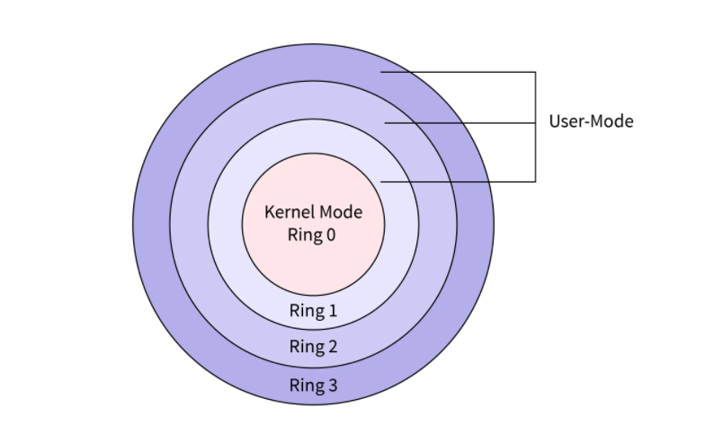
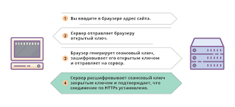
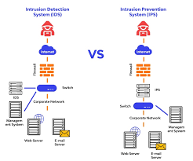

---
## Front matter
title: "Доклад на тему: Методы организации безопасности в операционных системах"
subtitle: "Архитектура компьютеров и операционные системы"
author: "Симонова Полина Игоревна"

## Generic otions
lang: ru-RU
toc-title: "Содержание"

## Bibliography
bibliography: bib/cite.bib
csl: pandoc/csl/gost-r-7-0-5-2008-numeric.csl

## Pdf output format
toc: true # Table of contents
toc-depth: 2
lof: true # List of figures
lot: true # List of tables
fontsize: 12pt
linestretch: 1.5
papersize: a4
documentclass: scrreprt
## I18n polyglossia
polyglossia-lang:
  name: russian
  options:
	- spelling=modern
	- babelshorthands=true
polyglossia-otherlangs:
  name: english
## I18n babel
babel-lang: russian
babel-otherlangs: english
## Fonts
mainfont: IBM Plex Serif
romanfont: IBM Plex Serif
sansfont: IBM Plex Sans
monofont: IBM Plex Mono
mathfont: STIX Two Math
mainfontoptions: Ligatures=Common,Ligatures=TeX,Scale=0.94
romanfontoptions: Ligatures=Common,Ligatures=TeX,Scale=0.94
sansfontoptions: Ligatures=Common,Ligatures=TeX,Scale=MatchLowercase,Scale=0.94
monofontoptions: Scale=MatchLowercase,Scale=0.94,FakeStretch=0.9
mathfontoptions:
## Biblatex
biblatex: true
biblio-style: "gost-numeric"
biblatexoptions:
  - parentracker=true
  - backend=biber
  - hyperref=auto
  - language=auto
  - autolang=other*
  - citestyle=gost-numeric
## Pandoc-crossref LaTeX customization
figureTitle: "Рис."
tableTitle: "Таблица"
listingTitle: "Листинг"
lofTitle: "Список иллюстраций"
lotTitle: "Список таблиц"
lolTitle: "Листинги"
## Misc options
indent: true
header-includes:
  - \usepackage{indentfirst}
  - \usepackage{float} # keep figures where there are in the text
  - \floatplacement{figure}{H} # keep figures where there are in the text
---

# Цель работы

Изучить основные методы обеспечения безопасности операционных систем и способы их применения в современных ОС (Windows, macOS, Linux)

# Задание

Изучить механизмы аутентификации и авторизации, их роль в защите данных;

Рассмотреть методы защиты памяти и процессов от вредносного воздействия;

Изучить межсетевые экраны и системы обнаружения вторжений, их роль в обеспечении безопасности.

# Теоретическое введение

Современные операционные системы (ОС) являются основой для работы компьютеров, серверов и мобильных устройств. Безопасность ОС — критически важный аспект, поскольку уязвимости могут привести к утечке данных, несанкционированному доступу и другим киберугрозам. В своем докладе я рассмотрю основные методы обеспечения безопасности операционных систем. 

# Аутентификация и авторизация 

## Аутентификация 

Аутентификация — процедура проверки подлинности, например проверка подлинности пользователя путем сравнения введенного им пароля с паролем, сохраненным в базе данных. 

Основные методы:

* Парольная защита (логин и пароль).

* Биометрическая аутентификация (отпечатки пальцев, сканирование лица).

* Двухфакторная аутентификация (2FA) (пароль + SMS-код или токен).

: Методы аутентификации

| Метод          | Примеры                 | Надежность | Сложность внедрения |
|----------------|-------------------------|------------|---------------------|
| Пароли         | Логин/пароль           | Низкая     | Очень простая       |
| 2FA            | SMS, Google Auth       | Средняя    | Простая             |
| Биометрия      | Face ID, отпечаток     | Высокая    | Средняя             |
| Сертификаты    | PKI, Smart-карты       | Очень высокая | Сложная         |

## Авторизация 

Авторизация - предоставление определенному лицу или группе лиц прав на выполнение определенных действий или права доступа к ресурсам. 

Основные методы:

* Дискреционное управление доступом (DAC) — владелец ресурса сам назначает права (например, в Linux через chmod). 

* Мандатное управление доступом (MAC) — строгие правила, заданные администратором (используется в SELinux). 

* Ролевое управление доступом (RBAC) — права назначаются ролям, а не пользователям. 

: Сравнение моделей управления доступом 

| Модель       | Применение            | Преимущества                | Недостатки              |
|--------------|-----------------------|-----------------------------|-------------------------|
| DAC          | Домашние ПК           | Простота управления        | Низкая безопасность     |
| MAC          | Госучреждения         | Максимальная защита        | Сложная настройка       |
| RBAC         | Корпоративные сети    | Централизованный контроль  | Требует администрирования |

# Защита памяти и процессов 

## Разделение адресных пространств 

ОС изолирует процессы, предотвращая их вмешательство в работу друг друга. 

* Виртуальная память — каждый процесс работает в своём адресном пространстве. 

* Защита ядра (Kernel Mode vs User Mode) — запрет пользовательским программам прямой доступ к аппаратным ресурсам. 

## Режим работы процессора (Kernel Mode vs User Mode)

* User Mode — ограниченный доступ (приложения не могут напрямую управлять железом). 

* Kernel Mode — полный доступ (только для драйверов и ядра ОС). (рис. @fig:001).

{#fig:001 width=70%}

Примеры: 

Windows: Virtual Memory Manager. 

Linux: механизм mmap.

## Контроль целостности процессов 

* ASLR (Address Space Layout Randomization) — рандомизация адресов в памяти для защиты от атак переполнения буфера. 

* DEP (Data Execution Prevention) — запрет выполнения кода в областях памяти, предназначенных для данных. 

* Sandboxing (песочницы) - изоляция процессов для предотвращения распространения вредоносного кода. 

Примеры: 

Google Chrome (каждая вкладка — отдельный процесс).
 
Firejail (Linux).

# Шифрование данных 

Шифрование — это метод защиты информации путём преобразования её в зашифрованный вид, который может быть расшифрован только с помощью ключа. В операционных системах шифрование может применяться для защиты данных на жёстком диске, в памяти, при передаче по сети и т.д

## Шифрование файловых систем 

BitLocker (Windows) и LUKS (Linux) — полное шифрование диска. 

EFS (Encrypting File System) — шифрование отдельных файлов в Windows. 

## Защита сетевого трафика 

* VPN (Virtual Private Network) - виртуальная частная сеть, создает частное сетевое подключение между устройствами с помощью Интернета. 

* Защищённый туннель для удалённого доступа (OpenVPN, WireGuard) - сетевой протокол, который обеспечивает безопасный удаленный доступ к операционной системе сервера. Он создает защищенный канал связи между двумя устройствами, позволяет пользователям безопасно подключаться к удаленной ОС и передавать данные.

* SSL (Secure Sockets Layer)/TLS (Transport Level Security) - это цифровой документ, который подтверждает подлинность веб-сайта и обеспечивает зашифрованное соединение. Он устанавливает защищенную связь между веб-сервером и браузером, гарантируя, что любые передаваемые данные остаются конфиденциальными и безопасными.

* Шифрование веб-трафика (HTTPS). (рис. @fig:003) 

* IPSec (Шифрование на сетевом уровне) - это комплект протоколов, в состав которого входят почти 20 предложений по стандартам и 18 RFC. Он позволяет осуществлять подтверждение подлинности (аутентификацию), проверку целостности и/или шифрование IP-пакетов.

{#fig:003 width=70%}

# Межсетевые экраны и системы обнаружения вторжений 

Файрволы (Firewalls) — это программное или аппаратное устройство, которое контролирует и фильтрует сетевой трафик на основе заданных правил. Файерволы могут использоваться для защиты локальной сети от внешних угроз, а также для ограничения доступа к определённым ресурсам внутри сети.(рис. @fig:002)

* Встроенные брандмауэры (Windows Defender Firewall, iptables в Linux). 

* Гостеприимные и враждебные политики (разрешение/блокировка трафика). 

{#fig:002 width=90%}

## Системы обнаружения и предотвращения вторжений (IDS/IPS) 

IDS/IPS которые используются для выявления и предотвращения попыток несанкционированного проникновения во внутренние сети. Для удобства продукты из этой категории обозначают общей аббревиатурой, хотя по факту они делятся на два компонента: IDS обнаруживают подозрительные действия, IPS — предотвращают их. (рис. @fig:005)

* Snort, Suricata — анализ сетевого трафика на атаки. 

* HIPS (Host-based IPS) — мониторинг активности на уровне ОС. 

{#fig:005 width=70%}

# Обновления и мониторинг безопасности 

* Регулярные обновления (патчи уязвимостей). Windows Update, apt upgrade (Linux), App Store (macOS). Производители операционных систем регулярно выпускают обновления и патчи, которые устраняют уязвимости и улучшают безопасность системы. 

* Антивирусное ПО (сканирование на вредоносные программы). Windows Defender, ClamAV (Linux), Malwarebytes.

* Аудит безопасности (логирование событий, анализ журналов). 

* Журналы событий (Windows Event Viewer, /var/log/ в Linux). 

* SIEM-системы (Splunk, ELK Stack).

: Сравнение систем обновления в ОС 

| Критерий          | Windows               | Linux (Ubuntu)        | macOS                |
|-------------------|-----------------------|-----------------------|----------------------|
| Менеджер обновлений | Windows Update       | apt (APT)            | Software Update      |
| Частота обновлений | Ежемесячно (Patch Tuesday) | По мере выхода | Ежеквартально       |
| Критические исправления | Автоматически через WU | Вручную/авто через репозитории | С задержкой 1-2 недели |
| Поддержка EOL*     | 5-10 лет             | До 10 лет (LTS)       | ~7 лет              |
| Риски             | "Сломанные" обновления | Конфликты зависимостей | Задержки безопасности |

*EOL - End of Life (срок поддержки)

# Заключение 

Безопасность операционных систем обеспечивается комплексом методов: от аутентификации и шифрования до защиты памяти и сетевой безопасности. Постоянное развитие угроз требует регулярного обновления защитных механизмов и обучения пользователей. Современные ОС, такие как Windows, Linux и macOS, интегрируют множество встроенных средств защиты, но их эффективность зависит от грамотной настройки и администрирования. 

# Выводы

Я изучила механизмы аутентификации и авторизации, методы защиты памяти и процессов от вредоносного воздействия и их роль в защите данных.

# Список литературы

1. Таненбаум Э. Современные операционные системы

2. Голдовский И.М. Безопасность операционных систем 

3. Официальная документация по безопасности Windows / Microsoft Corp. 

4. The Linux Foundation Security documentation 

5. Apple Platform Security 

