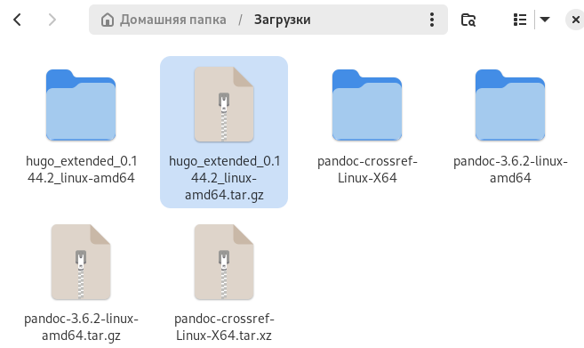
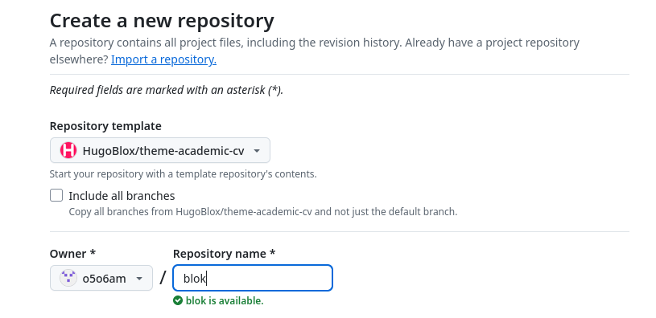
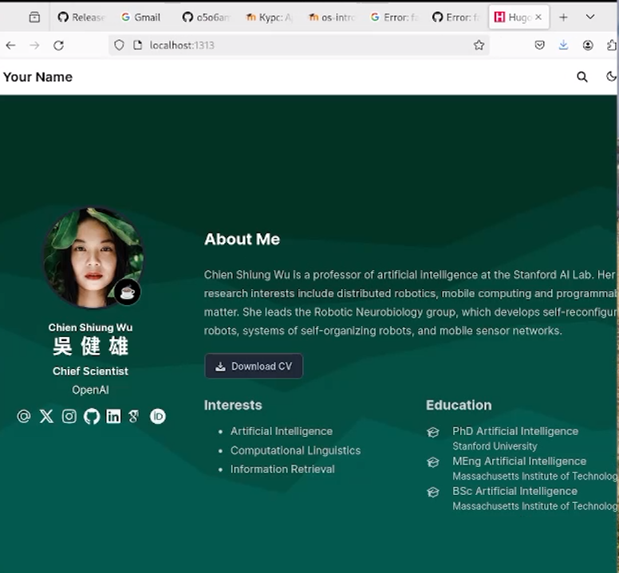
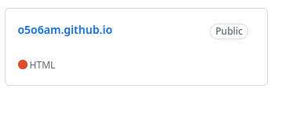
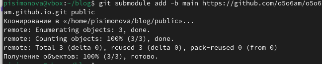
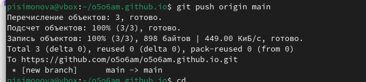

---
## Front matter
lang: ru-RU
title: Индивидуальный проект. Первый этап
subtitle: Операционные системы
author:
  - Симонова П.И.
institute:
  - Российский университет дружбы народов, Москва, Россия
date: 01 марта 2025

## i18n babel
babel-lang: russian
babel-otherlangs: english

## Formatting pdf
toc: false
toc-title: Содержание
slide_level: 2
aspectratio: 169
section-titles: true
theme: metropolis
header-includes:
 - \metroset{progressbar=frametitle,sectionpage=progressbar,numbering=fraction}
---

# Информация

## Докладчик

:::::::::::::: {.columns align=center}
::: {.column width="70%"}

  * Симонова Полина Игоревна
  * студент бакалавриата
  * Российский университет дружбы народов
  * [1132246738@rudn.ru](mailto:kulyabov-ds@rudn.ru)
  * <https://o5o6am.github.io/>

:::
::: {.column width="30%"}

:::
::::::::::::::

# Вводная часть

## Актуальность

- Персональный сайт - проект, который развивает навыки работы с системой git.
- Получение опыта в создании сайтов для возможного дальнейшего прменения  умений на практике

## Цели 

- Создать шаблон сайта

## Задачи

1. Установить необходимое ПО
2. Скачать шаблон темы сайта
3. Разместить его на хостинге Git
4. Установить параметр для URLs сайта
5. Разместить заготовку сайта на Github pages.

## ПО и инструменты

- hugo (рис. 1).
- Github
- git
- Github pages

## ПО и инструменты

Создаю свой репозиторий blog (рис. 2).

## Выполнение первого этапа проекта

Получаем страницу сайта на локальном сервере (рис. 3).

## Установка параметр для URLs сайта

Создаю новый пустой репозиторий, чье имя будет адресом сайта (рис. 4).

## Установка параметр для URLs сайта

Подключаю репозиторий к каталогу public (рис. 6).

## Размещение заготовку сайта на Github pages.

Проверяю есть ли подключение между public и репозиторием o5o6am.github.io, после чего отправляю изменения на глобальный репозиторий (рис. 7).

## Результаты

- Мы научились использовать репозитории для работы в git
- Смогли установить необходимые ПО для создания персонального сайта
- Узнали о структуре создания сайтов с помощью git

## Итоговый слайд

- Чем больше вы практикуетесь и пробуете новое, тем больше и чаще вы будете получать знаний и опыта в разных сферах.

