---
## Front matter
title: "Индивидуальный проект. Первый этап"
subtitle: "Операционные системы"
author: "Симонова Полина Игоревна"

## Generic otions
lang: ru-RU
toc-title: "Содержание"

## Bibliography
bibliography: bib/cite.bib
csl: pandoc/csl/gost-r-7-0-5-2008-numeric.csl

## Pdf output format
toc: true # Table of contents
toc-depth: 2
lof: true # List of figures
fontsize: 12pt
linestretch: 1.5
papersize: a4
documentclass: scrreprt
## I18n polyglossia
polyglossia-lang:
  name: russian
  options:
	- spelling=modern
	- babelshorthands=true
polyglossia-otherlangs:
  name: english
## I18n babel
babel-lang: russian
babel-otherlangs: english
## Fonts
mainfont: IBM Plex Serif
romanfont: IBM Plex Serif
sansfont: IBM Plex Sans
monofont: IBM Plex Mono
mathfont: STIX Two Math
mainfontoptions: Ligatures=Common,Ligatures=TeX,Scale=0.94
romanfontoptions: Ligatures=Common,Ligatures=TeX,Scale=0.94
sansfontoptions: Ligatures=Common,Ligatures=TeX,Scale=MatchLowercase,Scale=0.94
monofontoptions: Scale=MatchLowercase,Scale=0.94,FakeStretch=0.9
mathfontoptions:
## Biblatex
biblatex: true
biblio-style: "gost-numeric"
biblatexoptions:
  - parentracker=true
  - backend=biber
  - hyperref=auto
  - language=auto
  - autolang=other*
  - citestyle=gost-numeric
## Pandoc-crossref LaTeX customization
figureTitle: "Рис."
tableTitle: "Таблица"
listingTitle: "Листинг"
lofTitle: "Список иллюстраций"
lolTitle: "Листинги"
## Misc options
indent: true
header-includes:
  - \usepackage{indentfirst}
  - \usepackage{float} # keep figures where there are in the text
  - \floatplacement{figure}{H} # keep figures where there are in the text
---

# Цель работы

Создание персонального сайта с помощью GitHub. Размещение своего проекта на хостинге git. 

# Задание

Размещение на GitHub Pages заготовки для персональеого сайта.

# Выполнение индивидуального проекта

1. Скачивание ПО hugo для дальнейшей работы (рис. [-@fig:001]).

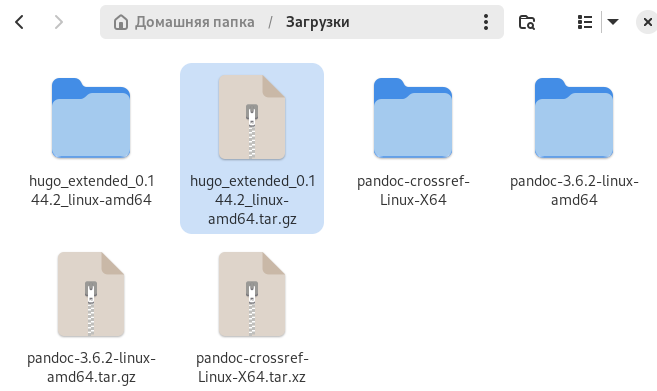{#fig:001 width=70%}

2. Создание папки bin и перемещение туда файла hugo (рис. [-@fig:002]).

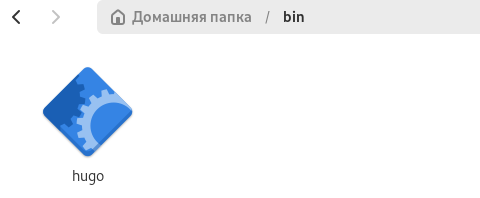{#fig:002 width=70%}

3. Клонирование шаблона hugo academic для персонального сайта (рис. [-@fig:003])

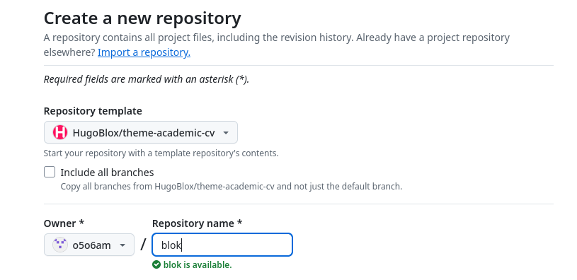{#fig:003 width=70%}

4. Первые этапы создания сайта (рис. [-@fig:004])

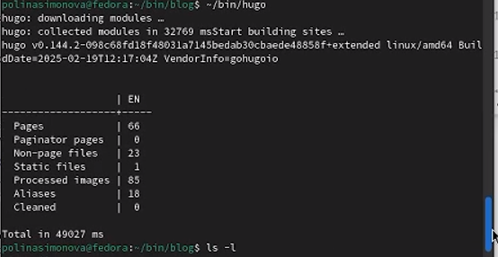{#fig:004 width=70%}

5. Проверка сайта на локальном уровне. (рис. [-@fig:005])

{#fig:005 width=70%}

6. Создание именного репозитория для проекта сайта o5o6am.github.io (рис. [-@fig:006])

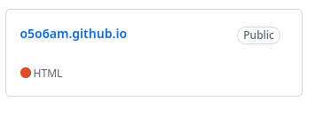{#fig:006 width=70%}

7. Клонирование файлов репозитория для сайта (рис. [-@fig:007])

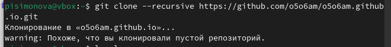{#fig:007 width=70%}

8. Создание ветки (рис. [-@fig:008])

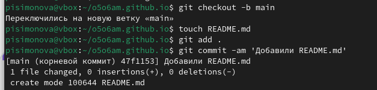{#fig:008 width=70%}

9. Ввод команды origin для правильной работы ветки main (рис. [-@fig:009])

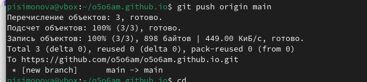{#fig:009 width=70%}

10. Добавление ветки main и создание папки public (рис. [-@fig:010])

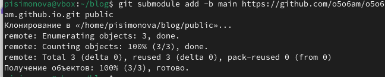{#fig:010 width=70%}

11. Добавление файлов сайта (рис. [-@fig:011])

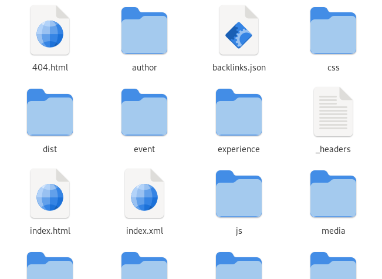{#fig:011 width=70%}

12. Проверка сайта на работу вне системы (рис. [-@fig:012])

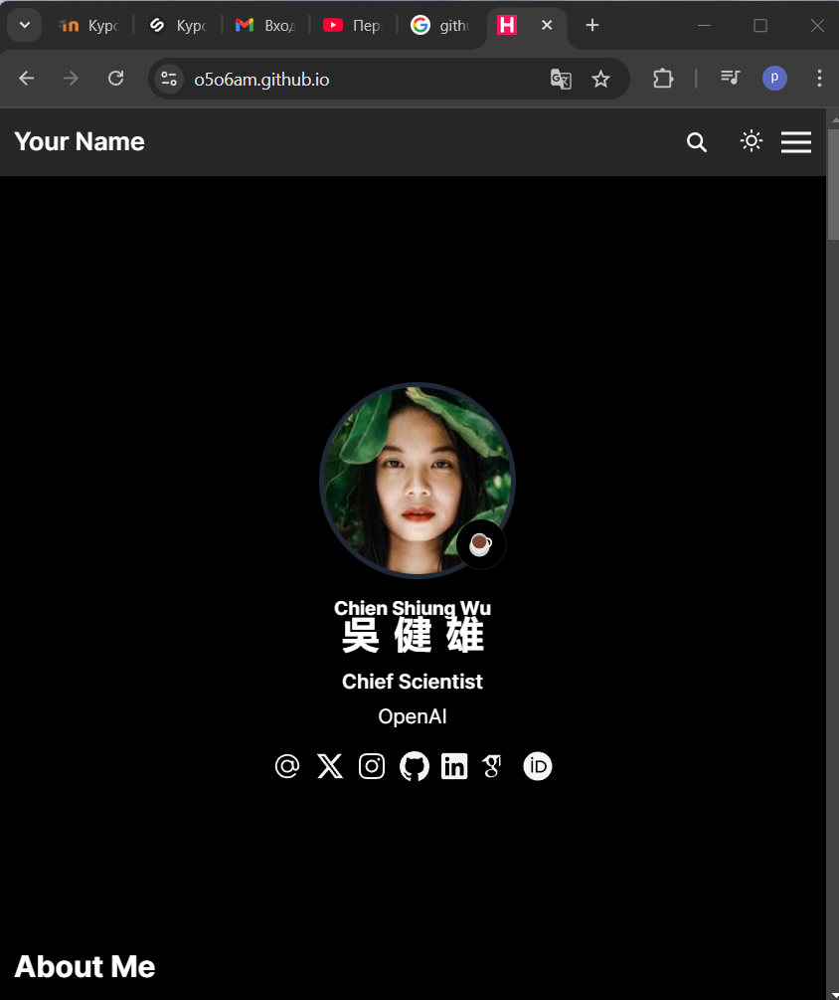{#fig:012 width=70%}

# Выводы

Мы создали персональный сайт по шаблону, используя необходимые репозитории.

