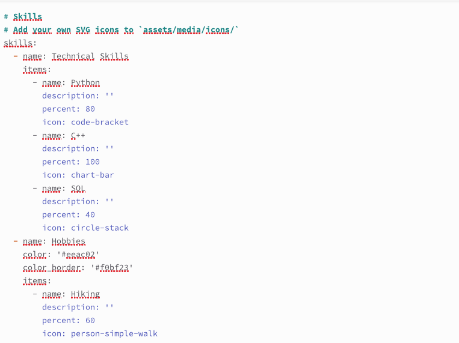

---
## Front matter
lang: ru-RU
title: Структура научной презентации
subtitle: Простейший шаблон
author:
  - Симонова П. И.
institute:
  - Российский университет дружбы народов, Москва, Россия
date: 08 апреля 2025

## i18n babel
babel-lang: russian
babel-otherlangs: english

## Formatting pdf
toc: false
toc-title: Содержание
slide_level: 2
aspectratio: 169
section-titles: true
theme: metropolis
header-includes:
 - \metroset{progressbar=frametitle,sectionpage=progressbar,numbering=fraction}
---

# Информация

## Докладчик

:::::::::::::: {.columns align=center}
::: {.column width="70%"}

  * Симонова Полина Игоревна
  * НКАбд-04-24, студ. билет №1132246738
  * Российский университет дружбы народов
  * <https://o5o6am.github.io/>

:::
::: {.column width="30%"}
:::
::::::::::::::

## Цель работы

Продолжить работу с сайтом, добавить личные достижения

# Задание

1. Добавить информацию о навыках (Skills).
2. Добавить информацию об опыте (Experience).
3. Добавить информацию о достижениях (Accomplishments).
4. Сделать пост по прошедшей неделе.
5. Добавить пост на тему по выбору: Легковесные языки разметки. Языки разметки. LaTeX. Язык разметки Markdown.

# Выполнение индивидуального проекта

1. Добавляю в index.md информацию о навыках. 

{#fig:001 width=70%}

##

2. Проверяю изменения на сайте. 

{#fig:002 width=70%}

##

3. Ввожу информацию об опыте. 

{#fig:003 width=70%}

##

4. Ввожу информацию о достижениях 

{#fig:004 width=70%}

##

5. Проверяю внешний вид сайта. 

{#fig:005 width=70%}

##

6. Пишу пост на тему по выбору 

{#fig:006 width=70%}

##

7. Проверяю изменения на сайте. 

{#fig:007 width=70%}

##

8. Пишу пост по прошедшей неделе 

{#fig:008 width=70%}

##

9. Проверяю изменения. 

{#fig:009 width=70%}

# Выводы

Мы продолжили работу с сайтом, добавили личные достижения.
