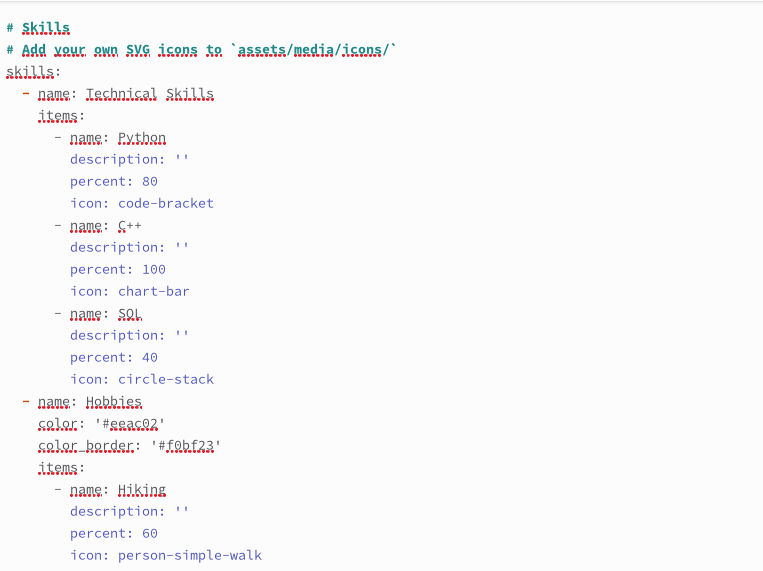
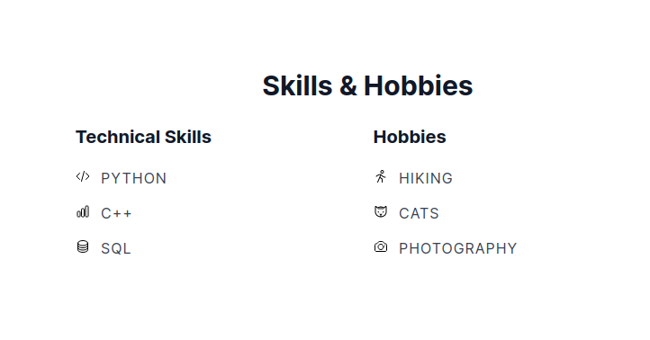
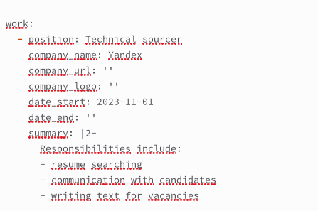
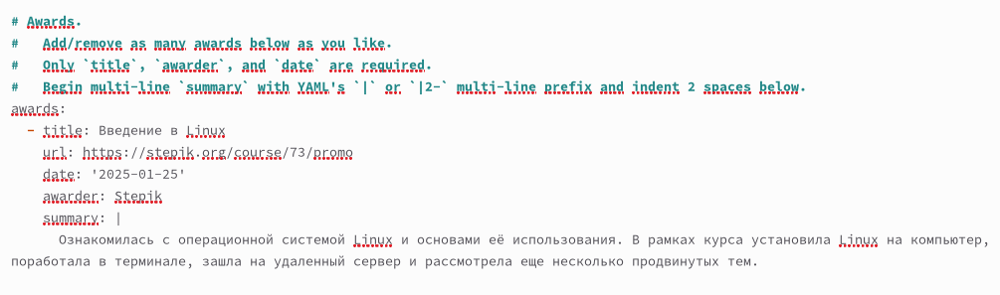
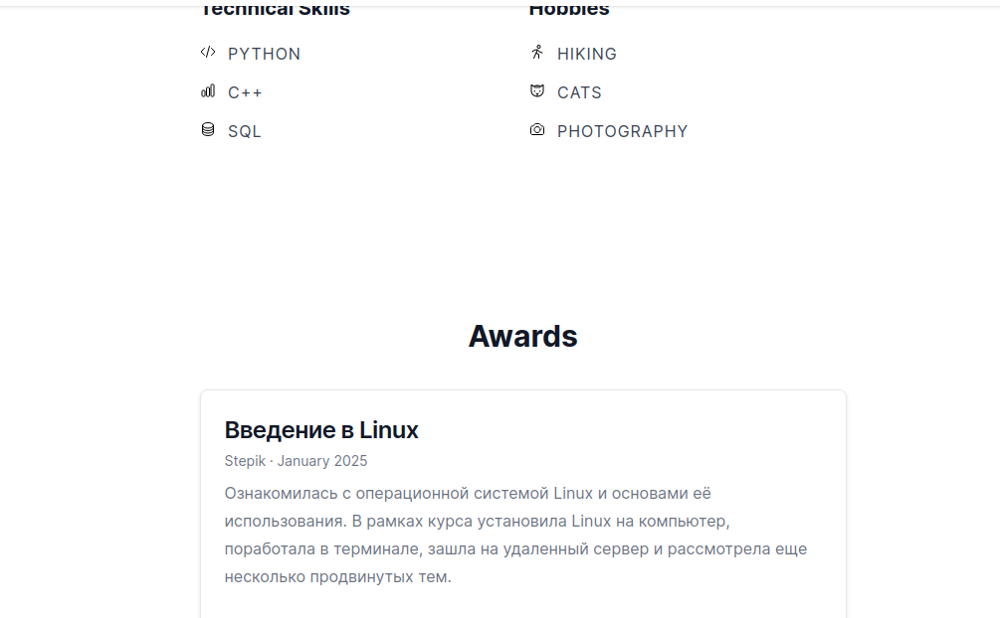
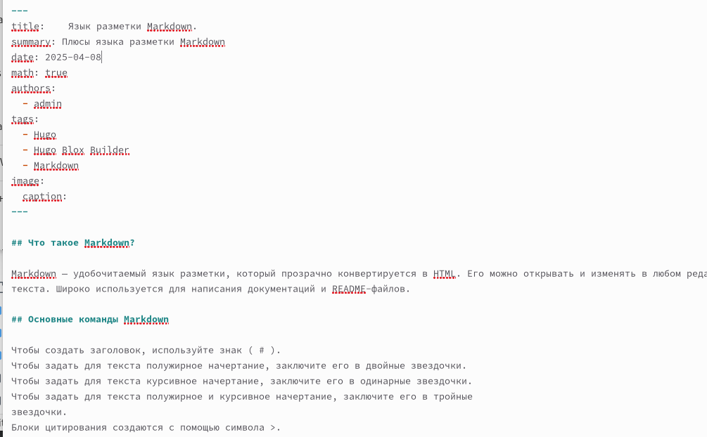
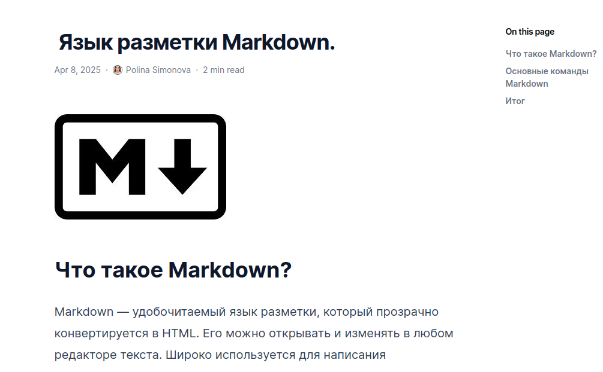
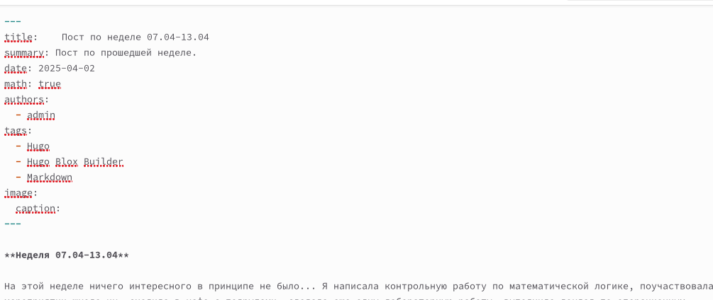
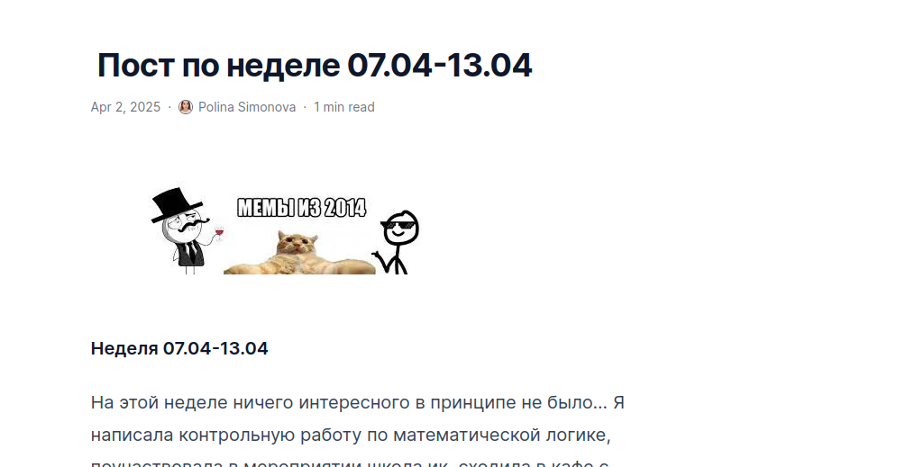

---
## Front matter
title: "Отчет по выполнению индивидуального проекта"
subtitle: "3 этап "
author: "Симонова Полина Игоревна"

## Generic otions
lang: ru-RU
toc-title: "Содержание"

## Bibliography
bibliography: bib/cite.bib
csl: pandoc/csl/gost-r-7-0-5-2008-numeric.csl

## Pdf output format
toc: true # Table of contents
toc-depth: 2
lof: true # List of figures
lot: true # List of tables
fontsize: 12pt
linestretch: 1.5
papersize: a4
documentclass: scrreprt
## I18n polyglossia
polyglossia-lang:
  name: russian
  options:
	- spelling=modern
	- babelshorthands=true
polyglossia-otherlangs:
  name: english
## I18n babel
babel-lang: russian
babel-otherlangs: english
## Fonts
mainfont: IBM Plex Serif
romanfont: IBM Plex Serif
sansfont: IBM Plex Sans
monofont: IBM Plex Mono
mathfont: STIX Two Math
mainfontoptions: Ligatures=Common,Ligatures=TeX,Scale=0.94
romanfontoptions: Ligatures=Common,Ligatures=TeX,Scale=0.94
sansfontoptions: Ligatures=Common,Ligatures=TeX,Scale=MatchLowercase,Scale=0.94
monofontoptions: Scale=MatchLowercase,Scale=0.94,FakeStretch=0.9
mathfontoptions:
## Biblatex
biblatex: true
biblio-style: "gost-numeric"
biblatexoptions:
  - parentracker=true
  - backend=biber
  - hyperref=auto
  - language=auto
  - autolang=other*
  - citestyle=gost-numeric
## Pandoc-crossref LaTeX customization
figureTitle: "Рис."
tableTitle: "Таблица"
listingTitle: "Листинг"
lofTitle: "Список иллюстраций"
lotTitle: "Список таблиц"
lolTitle: "Листинги"
## Misc options
indent: true
header-includes:
  - \usepackage{indentfirst}
  - \usepackage{float} # keep figures where there are in the text
  - \floatplacement{figure}{H} # keep figures where there are in the text
---

# Цель работы

Продолжить работу с сайтом, добавить личные достижения

# Задание

1. Добавить информацию о навыках (Skills).
2. Добавить информацию об опыте (Experience).
3. Добавить информацию о достижениях (Accomplishments).
4. Сделать пост по прошедшей неделе.
5. Добавить пост на тему по выбору: Легковесные языки разметки. Языки разметки. LaTeX. Язык разметки Markdown.

# Выполнение индивидуального проекта

1. Добавляю в index.md информацию о навыках.  (рис. @fig:001).

{#fig:001 width=70%}

2. Проверяю изменения на сайте. (рис. @fig:002).

{#fig:002 width=70%}

3. Ввожу информацию об опыте. (рис. @fig:003).

{#fig:003 width=70%}

4. Ввожу информацию о достижениях (рис. @fig:004).

{#fig:004 width=70%}

5. Проверяю внешний вид сайта.  (рис. @fig:005).

{#fig:005 width=70%}

6. Пишу пост на тему по выбору (рис. @fig:006).

{#fig:006 width=70%}

7. Проверяю изменения на сайте.  (рис. @fig:007).

{#fig:007 width=70%}

8. Пишу пост по прошедшей неделе (рис. @fig:008).

{#fig:008 width=70%}

9. Проверяю изменения.  (рис. @fig:009).

{#fig:009 width=70%}

# Выводы

Мы продолжили работу с сайтом, добавили личные достижения.

# Список литературы{.unnumbered}

::: {#refs}
:::
